# Data Lovers

## Índice

* [1. Preámbulo](#1-preámbulo)
* [2. Resumen del proyecto](#2-resumen-del-proyecto)
* [3. Historias de Usuarios y Diseño de la interfaz de usuario ](#3-objetivos-de-aprendizaje)
* [4. Implemententación de la interfaz de usuario.](#4-producto-final)
* [5. Pruebas unitarias.](#5-pruebas-unitarias)
* [6. Checklist.](#6-checklist)

***

## 1. Preámbulo

Rick y Morty es una serie de televisión americana de animación para adultos creada por Justin Roiland y Dan Harmon en 2013 para Adult Swim, también se emitió en Cartoon Network. La serie sigue las desventuras de un científico, Rick Sanchez, y su fácilmente influenciable nieto, Morty, quienes pasan el tiempo entre la vida doméstica y los viajes espaciales, temporales e intergalácticos. Dan Harmon, el co-creador de la serie y Justin Roiland son los encargados de las voces principales de Morty y Rick, la serie también incluye las voces de Chris Parnell, Spencer Grammer y Sarah Chalke.

## 2. Definición del producto

En este proyecto el objetivo principal es que el usuario de Rick and Morty Lovers pueda ver una interfaz con la data de la serie televisión, en donde pueda encontrar las características más importantes de sus personajes, buscar, filtrar y ordenar los mismos y también visualizar la estadística de personajes por género.

Estos son los datos utilizados:

* [Rick and Morty](src/data/rickandmorty/rickandmorty.json).
  Este set nos proporciona la lista de los personajes de la serie Rick and
  Morty. [API Rick and Morty](https://rickandmortyapi.com).
  - [Investigación con seguidores de Rick and Morty](src/data/rickandmorty/README.md)

## 3. Historias de Usuario

*Historia Usuario 1:*

Yo como usuario de Rick and Morty Lovers quiero ver los personajes para conocerlos.

#### Prototipo de baja fidelidad

#### Prototipo de alta fidelidad

*Historia Usuario 2:*

Yo como usuario de Rick and Morty Lovers quiero buscar los personajes por su nombre para acceder de forma más especifica

#### Prototipo de baja fidelidad

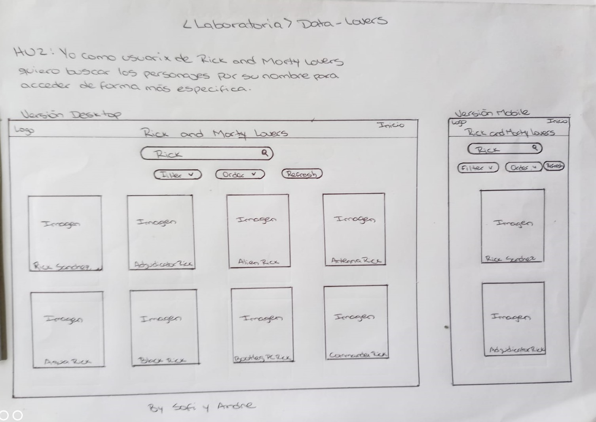

#### Prototipo de alta fidelidad

*Historia Usuario 3:*

Yo como usuario de Rick and Morty Lovers quiero filtrar los personajes para acceder a información de especie y género de forma más especifica

#### Prototipo de baja fidelidad

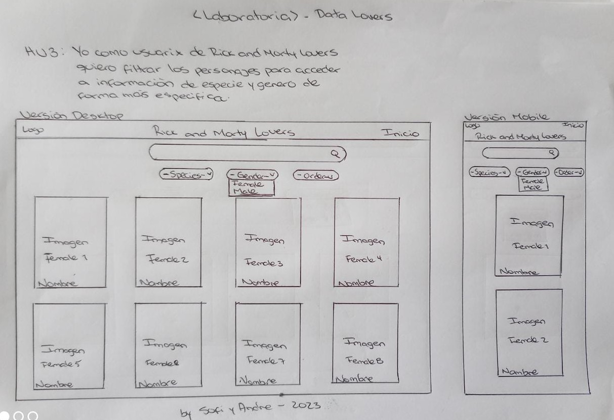

#### Prototipo de alta fidelidad

*Historia Usuario 4:*

Yo como usuario de Rick and Morty Lovers quiero ordenar los personajes para encontrarlos en orden alfabético.

#### Prototipo de baja fidelidad

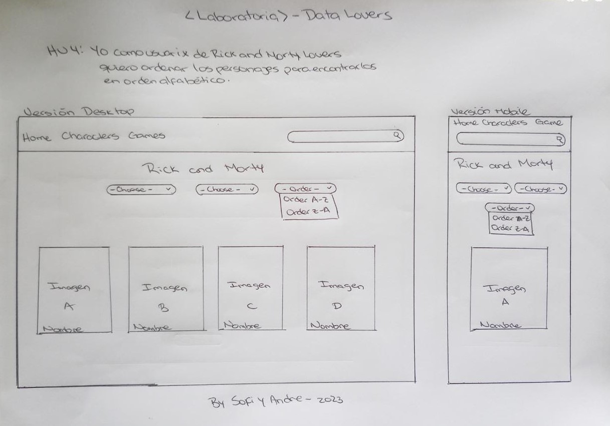

#### Prototipo de alta fidelidad

*Historia Usuario 5:*

Yo como usuario de Rick and Morty Lovers quiero ver estadísticas sobre los personajes para conocer la cantidad por especia que hay en la serie.

#### Prototipo de baja fidelidad

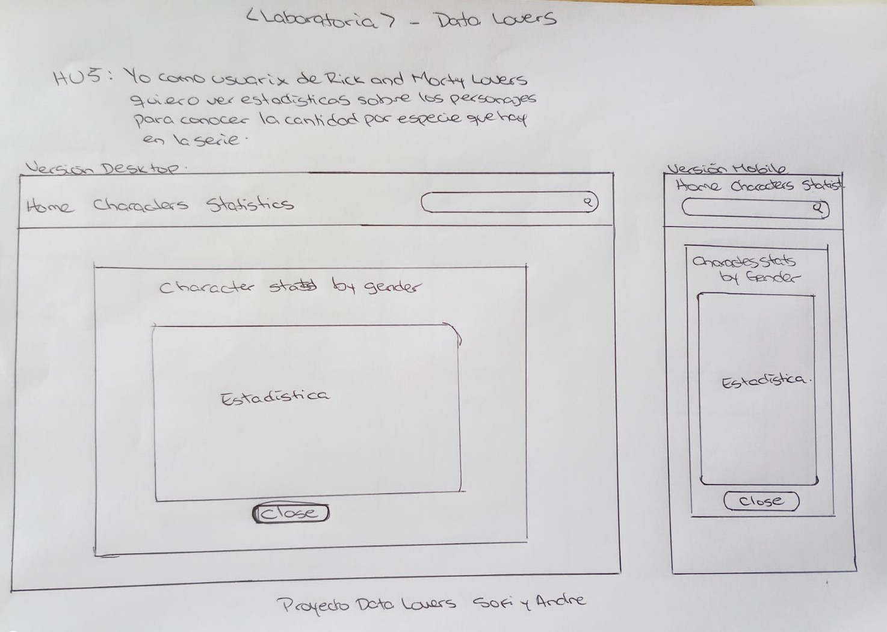

#### Prototipo de alta fidelidad

*Link a Figma:* 

## 4. Implemententación de la interfaz de usuario.
#### Producto final

*Inicio*

Al ingresar al inicio (home), carga los primeros 20 personajes de la data, y el usuario puede visualizar las opciones para filtrar, bien sea por nombre (en el buscador), por especie o por género, asímismo se encuentra un botón para ordenar alfabeticamente de forma ascendente y descendente.

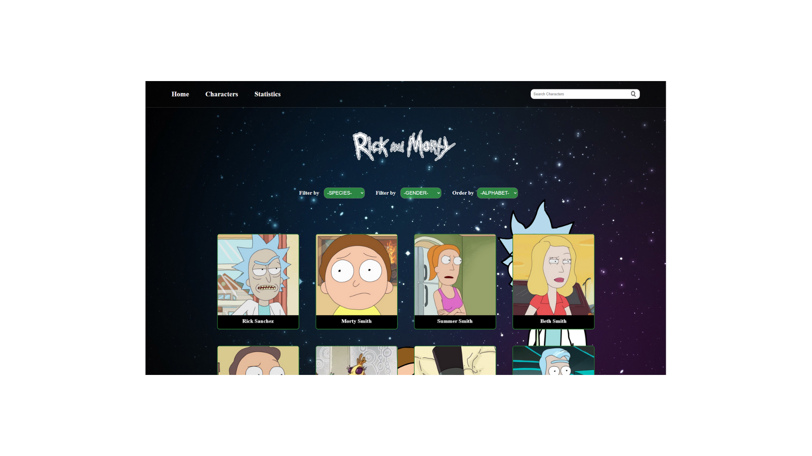

*Personajes*

Al ingresar a la pestaña de personajes (characters), carga los 493 personajes que existen en la data, para que el usuario pueda acceder a la información de cada uno de ellos.

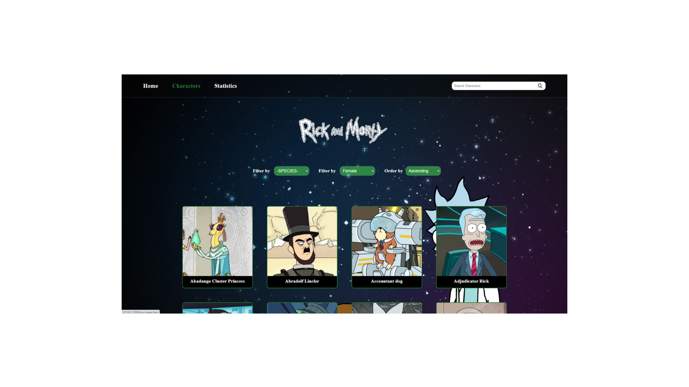

*Interacción de las tarjetas*

Cada tarjeta de cada personaje, contiene en la parte trasera información relevante del mismo, con sólo dar clic el usuario puede acceder a esa información.

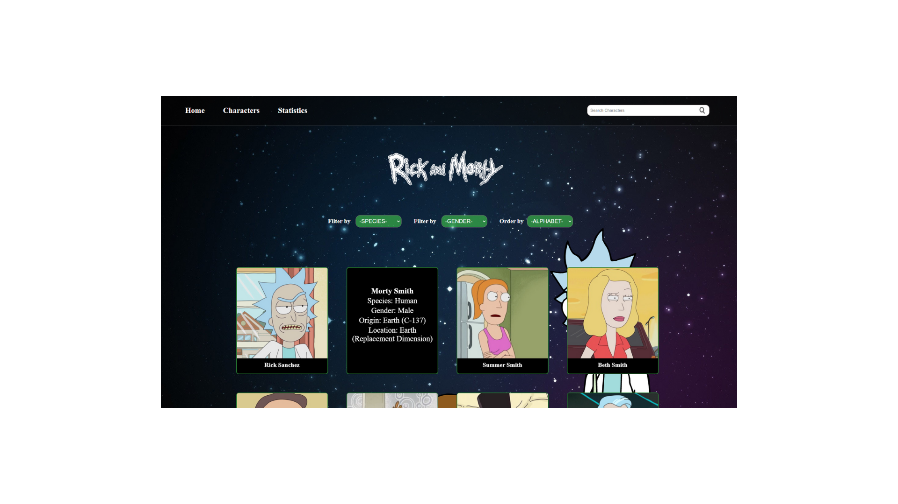

*Filtrar*

En la pantalla principal el usuario puede ver dos botones para filtrar los personajes, bien sea por especie o por género, y en la parte superior derecha un buscador que funciona con el nombre de los personajes; al escoger la opción que desee, le muestra todos los personajes que hay en la data con ese tipo de filtro (estos filtros funcionan de forma anidada).

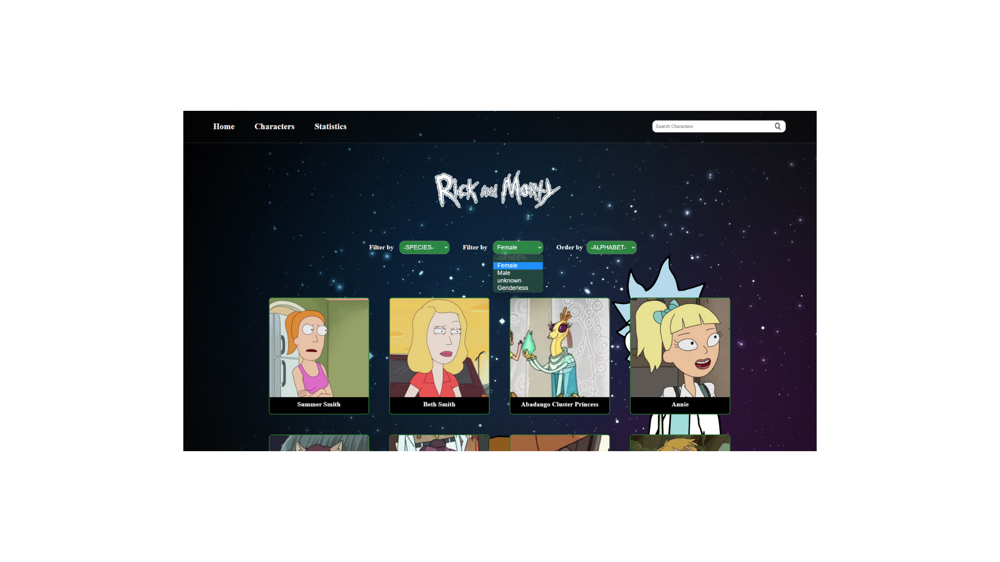

*Ordenar*

Asímismo, se encuentra en la pantalla principal un botón para ordenar alfabéticamente de forma ascendente y descendente todos los personajes.

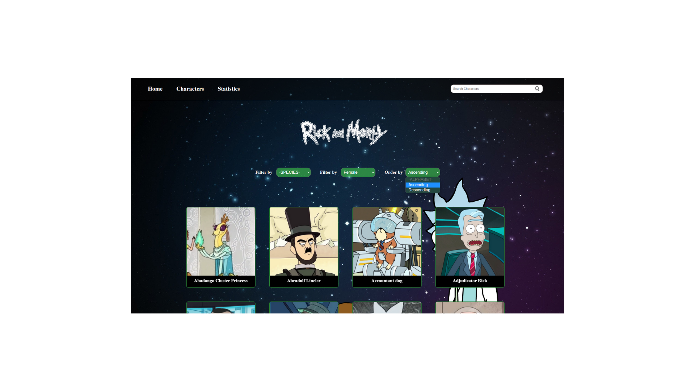

*Estadística*

Al ingresar a la pestaña de estadísticas (stadistics), ubicada en la parte superior izquierda, el usuario podrá visualizar la estadística de los personajes por género. 

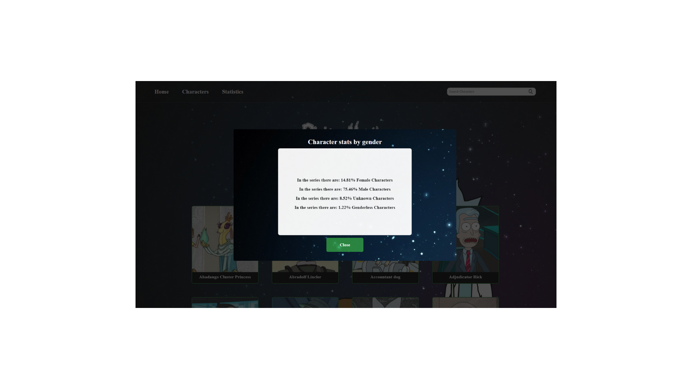

## 5. Pruebas unitarias.
#### Test
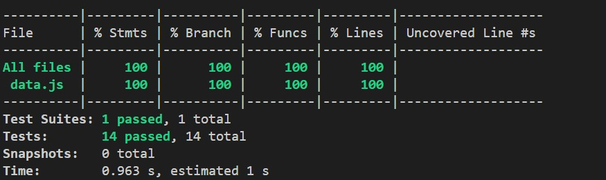

#### Test de usabilidad:

- Limitamos el mostrar todos los personajes, indicaron que se veía recargado.
- Mostramos los personajes en filas de 4 tarjetas y con cierto espacio entre ellos, para visualizarlos mejor.
- Aumentamos el tamaño de los botones de selección.
- Utilizamos una etiqueta para describir el nombre de cada botón de selección, para ser más descriptivo.
- Cambiamos el color de fondo de las opciones del botón de filtrado, para tener mejor contraste.
- Se realizó el anidado de los filtros buscar, especie y género, para que el usuario pueda encontrar el personaje de forma más específica.
- Agregamos interacción al link de estadística para desplegar una pantalla con la información del porcentaje por género.

## 6. Checklist.

* [x]Usa VanillaJS.
* [x]Pasa linter (npm pretest)
* [x]Pasa tests (npm test)
* [x]Pruebas unitarias cubren un mínimo del 70% de statements, functions y lines y branches.
* [x]Incluye Definición del producto clara e informativa en README.md.
* [x]Incluye historias de usuario en README.md.
* [x]Incluye sketch de la solución (prototipo de baja fidelidad) en README.md.
* [x]Incluye Diseño de la Interfaz de Usuario (prototipo de alta fidelidad) en README.md.
* [x]Incluye link a Figma en README.md.
* [x]Incluye el listado de problemas que detectaste a través de tests de usabilidad en el README.md.
* [x]UI: Muestra lista y/o tabla con datos y/o indicadores.
* [x]UI: Permite ordenar data por uno o más campos (asc y desc).
* [x]UI: Permite filtrar data en base a una condición.
* [x]UI: Es responsive.