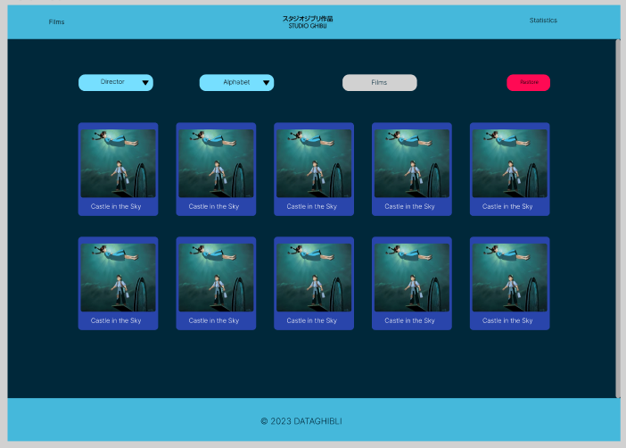

# Studio Ghibli

## Índice

- [1. Resumen del proyecto](#1-resumen-del-proyecto)
- [2. Funcionamiento de la página](#2-funcionamiento-de-la-pagina)
- [3. Historias de usuario](#3-historias-de-usuario)
- [4. Prototipado](#4-prototipado)
- [5. Testeos de usabilidad](#5-testeos-de-usabilidad)

---

## 1. Resumen del proyecto

En el proyecto construimos una página web dirigida al público de Studio Ghibli, en la cual nuestros usuarios puedan visualizar data que se adecuen a sus necesidades.

El objetivo de dicha página es que el usuario pueda conocer, entender e investigar sobre el Studio Ghibli para lo cual la página cuenta con interacciones en las cuales podrás visualizar las películas con sus respectivas imágenes y títulos, también se le permite filtrar, ordenar, buscar las películas y se muestra un gráfico de las especies de cada personaje.

## 2. Funcionamiento de la pagina

La primera interface muestra los posters de las veinte películas producidas y dirigidas por él Studio Ghibli de 1986 a 2014, donde es posible filtrar por directores, ordenar alfabéticamente o realizar una búsqueda por él título de la película. La segunda interface es donde se muestra él gráfico con la cantidad de especie de los personajes.

## 3. Historias de usuario

¿Quiénes son los principales usuarios de producto?
Público en general que disfrute de las películas de Studio Ghibli y quiera conocer más.

¿Cuáles son los objetivos de estos usuarios en relación con el producto?
Tiene como objetivo saber y conocer más sobre las películas del Studio Ghibli.

¿Cuáles son los datos más relevantes que quieren ver en la interfaz y por qué?
Quieren una página web accesible donde puedan ver las películas y se les permita filtrar, ordenar y buscar.

¿Cuándo utilizan o utilizarían el producto?
Cuando quieran buscar alguna película o curiosidad sobre el Studio Ghibli.

HU1: Yo como usuaria de Data Lovers quiero que se muestre las películas del Studio Ghibli para ver que películas tienen.

Criterios de aceptación:

- Al abrir la página que me muestre las imágenes de las peliculas y el nombre de cada película.

Criterios de Terminado:

- Realizar prototipo de baja fidelidad.
- Estructura visual adecuada (header, main, footer).
- Renderizar peliculas y sus nombres.

HU2: Yo como usuaria quiero que me permita ver los directores para saber quién dirigió la película.

Criterios de aceptación:

- Que me permite verificar quien dirigió la película.
- Mostrar los nombres de los directores.

Criterios de Terminado:

- Crear un botón que me permita filtrar por director.
- Importar la información de la data.
- Renderizar la información.
- Hacer las pruebas unitarias.

HU3: Yo como usuaria quiero que se muestre las peliculas en orden alfabético para elegir una película de acuerdo a eso.

Criterios de aceptación:

- Que pueda elegir alfabéticamente las peliculas.
- Que muestre las peliculas de acuerdo a lo que solicite.

Criterios de Terminado:

- Crear un botón que me permita ordenar por alfabéticamente peliculas.
- Importar la información de la data.
- Renderizar la información.
- Hacer las pruebas unitarias.

HU4: Yo como usuaria quiero poder buscar la película por el nombre para facilitar mi búsqueda.

Criterios de aceptación:

- Que me permita buscar la película por el nombre.
- Que me muestre las peliculas que contengan la misma letra o palabra en su título.

Criterios de Terminado:

- Crear un Input que me permita almacenar textos o palabras.
- Realizar búsqueda en base al texto o palabras.
- Renderizar las peliculas que contentan los textos o palabras en el título.
- Realizar prueba unitaria.

HU5: Yo como usuaria quiero que me permita limpiar mis filtros, búsquedas y ordenados para luego poder empezar.

Criterios de aceptación:

- Que me permita borrar los cambios de la página.
- Que se pueda regresar al estado original de la página.

Criterios de Terminado:

- Implementar un botón para restaurar la página.
- Dar funcionabilidad al botón.

HU6: Yo como usuaria me gustaría saber más detalles del Studio Ghibli para conocer más.

Criterios de aceptación:

- Quiero conocer cuantas especies de cada personaje hay.

Criterios de Terminado:

- Importar información de los personajes por cada especie.
- Renderizar la información importada en un gráfico estadístico.
- Realizar prueba unitaria.
- Dar estilos al gráfico.

## 4. Prototipado

- Prototipo de baja fidelidad

  

- Prototipo de alta fidelidad

  

## 5. Testeos de usabilidad

Se realizaron testeos de usabilidad, donde se pudo iterar el prototipo inicial, y adaptar el diseño a las necesidades del usuario.

1. Se determino en un comienzo la implementación de un modal para que muestre la información (una para película, personajes, locaciones) sin estar conectadas entre sí. Al momento de la presentación del prototipo se decidió por cambiar a solo una página principal que mostrara todas las peliculas.
2. La paleta de colores inicial se cambió de tonalidad para identificarse con el logo de Ghibli, ya que la paleta anterior no expresaba la identidad del producto.
3. La interactividad con los botones fue rediseñada para ofrecer al usuario una claridad de las opciones de interacción con la página, para mejorar la experiencia de navegación del usuario.
