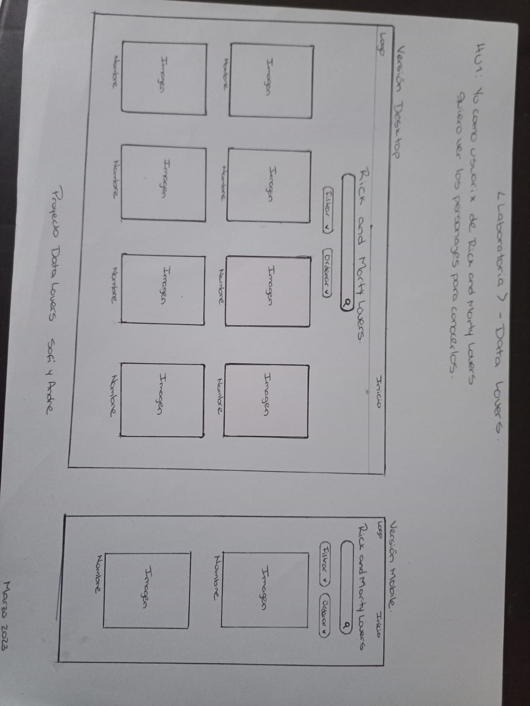
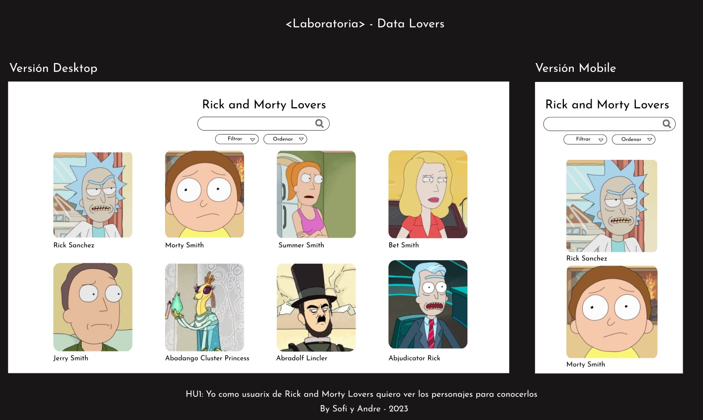
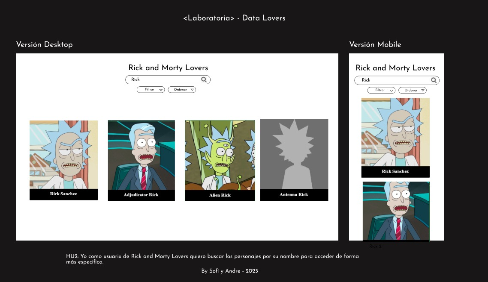
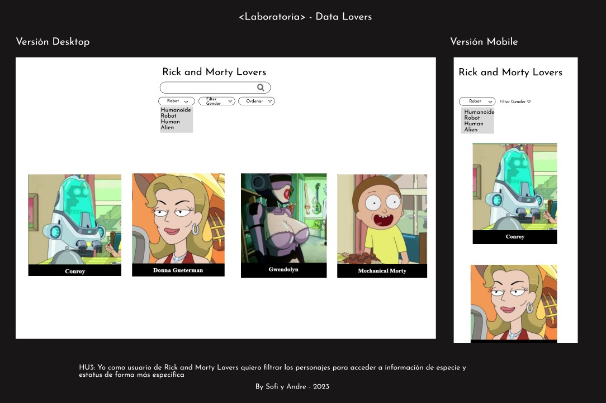
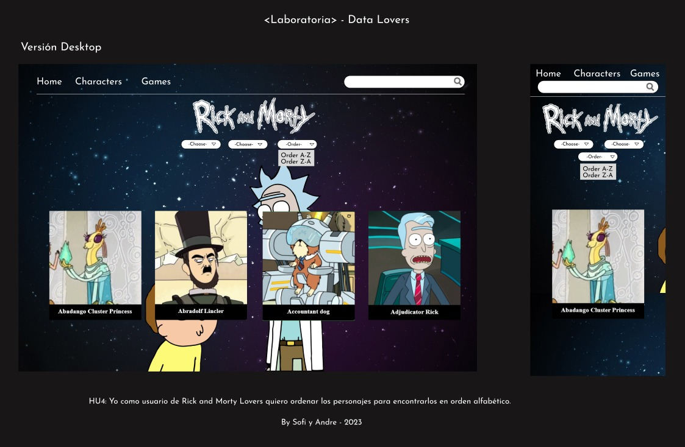
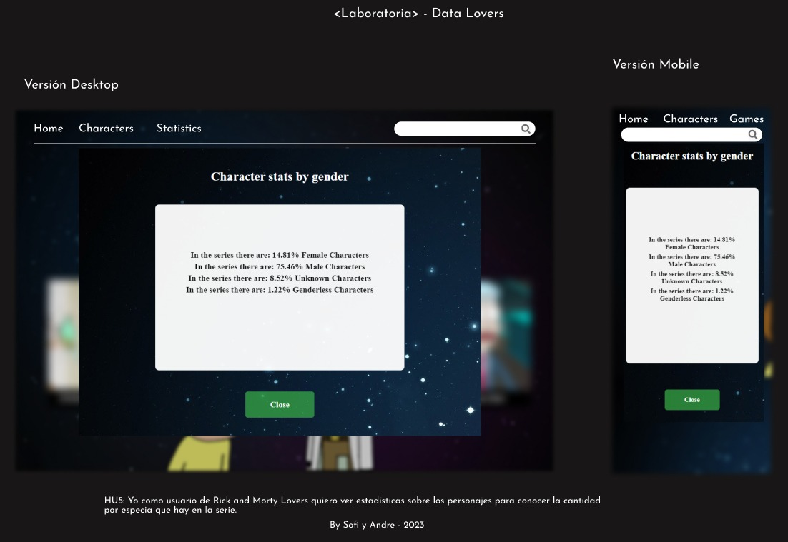
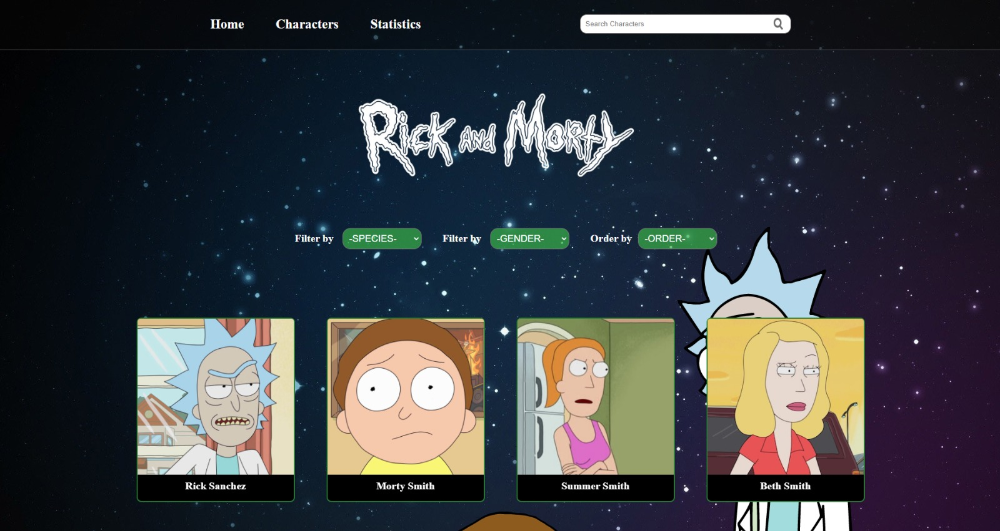
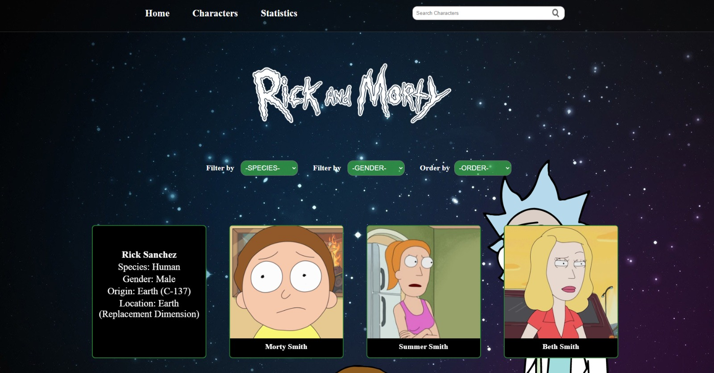

# Data Lovers

## Índice

* [1. Preámbulo](#1-preámbulo)
* [2. Resumen del proyecto](#2-resumen-del-proyecto)
* [3. Historias de Usuarios y Diseño de la interfaz de usuario ](#3-objetivos-de-aprendizaje)
* [4. Implemententación de la interfaz de usuario.](#4-producto-final)

***

## 1. Preámbulo

Rick y Morty es una serie de televisión americana de animación para adultos creada por Justin Roiland y Dan Harmon en 2013 para Adult Swim, también se emitió en Cartoon Network. La serie sigue las desventuras de un científico, Rick Sanchez, y su fácilmente influenciable nieto, Morty, quienes pasan el tiempo entre la vida doméstica y los viajes espaciales, temporales e intergalácticos. Dan Harmon, el co-creador de la serie y Justin Roiland son los encargados de las voces principales de Morty y Rick, la serie también incluye las voces de Chris Parnell, Spencer Grammer y Sarah Chalke.

## 2. Resumen del proyecto

En este proyecto el objetivo principal es que el usuario de Rick and Morty Lovers pueda ver una interfaz con la data de la serie televisión, en donde pueda encontrar las características más importantes de sus personajes.

Estos son los datos utilizados:

* [Rick and Morty](src/data/rickandmorty/rickandmorty.json).
  Este set nos proporciona la lista de los personajes de la serie Rick and
  Morty. [API Rick and Morty](https://rickandmortyapi.com).
  - [Investigación con seguidores de Rick and Morty](src/data/rickandmorty/README.md)

## 3. Historias de Usuario

*Historia Usuario 1:*

Yo como usuario de Rick and Morty Lovers quiero ver los personajes para conocerlos.

#### Prototipo de baja fidelidad

#### Prototipo de alta fidelidad

*Historia Usuario 2:*

Yo como usuario de Rick and Morty Lovers quiero buscar los personajes por su nombre para acceder de forma más especifica

#### Prototipo de baja fidelidad

#### Prototipo de alta fidelidad

*Historia Usuario 3:*

Yo como usuario de Rick and Morty Lovers quiero filtrar los personajes para acceder a información de especie y género de forma más especifica

#### Prototipo de baja fidelidad

#### Prototipo de alta fidelidad

*Historia Usuario 4:*

Yo como usuario de Rick and Morty Lovers quiero ordenar los personajes para encontrarlos en orden alfabético.

#### Prototipo de baja fidelidad

#### Prototipo de alta fidelidad

*Historia Usuario 5:*

Yo como usuario de Rick and Morty Lovers quiero ver estadísticas sobre los personajes para conocer la cantidad por especia que hay en la serie.

#### Prototipo de baja fidelidad

#### Prototipo de alta fidelidad

## 4. Implemententación de la interfaz de usuario.
#### Producto final

*Home*

Al ingresar al home, carga los primeros 20 personajes de la data, y el usuario puede visualizar las opciones para filtrar, bien sea por nombre (en el buscador), por especie o por género, asímismo se encuentra un botón para ordenar alfabeticamente de forma ascendente y descendente.

*Interacción de la tarjetas*

Cada tarjeta de cada personaje, contiene en la parte trasera información relevante del mismo, con sólo dar clic el usuario puede acceder a esa información.

*Interacción de la tarjetas*

