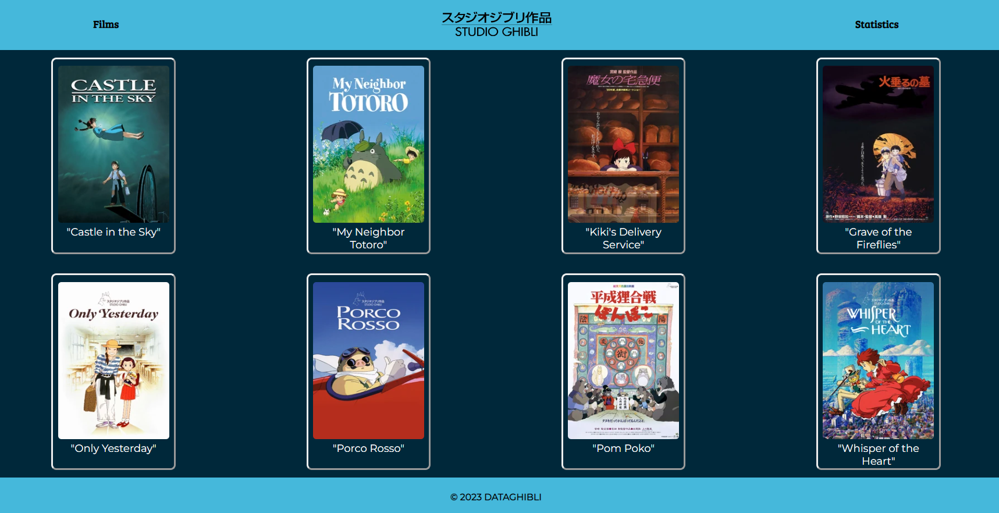

# Studio Ghibli

## Índice

- [1. Resumen del proyecto](#1-resumen-del-proyecto)
- [2. Historias de usuario](#2-historias-de-usuario)
- [3. Prototipado](#3-prototipado)
- [4. Testeos de usabilidad](#4-testeos-de-usabilidad)

---

## 1. Resumen del proyecto

En el proyecto construimos una página web dirigida al público de Studio Ghibli, en la cual nuestros usuarios puedan visualizar data que se adecuen a sus necesidades.

El objetivo de dicha página es que el usuario pueda conocer, entender e investigar sobre el Studio Ghibli para lo cual la página cuenta con interacciones en las cuales podrás visualizar las películas con sus respectivos títulos, también se le permita filtrar, ordenar, buscar las películas y un gráfico estadístico.

## 2. Historias de usuario

¿Quiénes son los principales usuarios de producto?
Público en general que disfrute de las películas de Studio Ghibli y quiera conocer más.

¿Cuáles son los objetivos de estos usuarios en relación con el producto?
Tiene como objetivo saber y conocer más sobre las películas del Studio Ghibli.

¿Cuáles son los datos más relevantes que quieren ver en la interfaz y por qué?
Quieren una página web accesible donde puedan ver las películas y se les permita filtrar, ordenar y buscar.

¿Cuándo utilizan o utilizarían el producto?
Cuando quieran buscar alguna película o curiosidad sobre el Studio Ghibli.

1. Yo como usuaria de la página web del Studio Ghibli, quiero me muestre cuales son las películas de Studio Ghibli.
2. Yo como usuaria de la página web del Studio Ghibli, quiero filtrar las películas, lo cual se me permita ver las películas de acuerdo de a su director.
3. Yo como usuaria de la página web del Studio Ghibli, quiero ordenar las películas, lo cual se me permita ordenar las películas de manera alfabéticamente.
4. Yo como usuaria de la página web del Studio Ghibli, quiero buscar las películas, lo cual me permita colocar el nombre o palabra de la película y que me sugiera.
5. Yo como usuaria de la página web del Studio Ghibli, quiero que me permita limpiar mis filtros, búsquedas y ordenados para luego poder empezar de nuevo.

## 3. Prototipado

- Prototipo de baja fidelidad
  
- Prototipo de alta fidelidad
  
